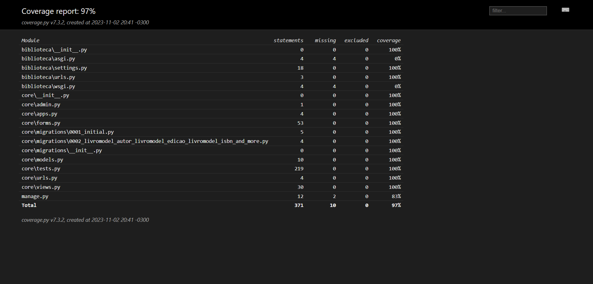

# Prática TDD

<h2>Autor: Giovani Ruzzon de Jesus Ortega - RA: 2901392223033</h2>

Desafio técnico para os alunos da disciplina "Desenvolvimento Web 3" 

No ambiente Windows:

```console
git clone https://github.com/GiovaniOrtegaFatec/Pratica_TDD_1_DW3.git
cd Pratica_TDD_1/
virtualenv venv
cd venv
cd scripts
activate.bat
cd ..
cd ..
pip install -r requirements.txt
cd biblioteca/
python manage.py migrate
python manage.py test
coverage run --source='.' manage.py test 
coverage html
python manage.py runserver

```


Coverage Report: 97%

