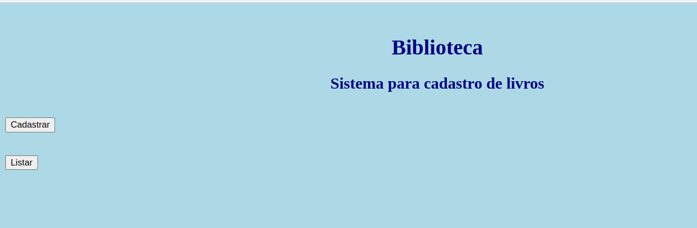
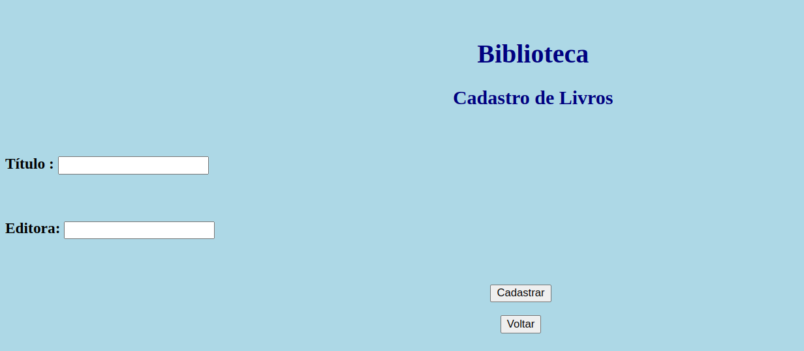
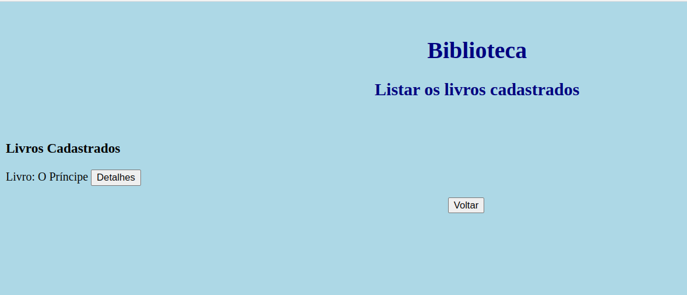
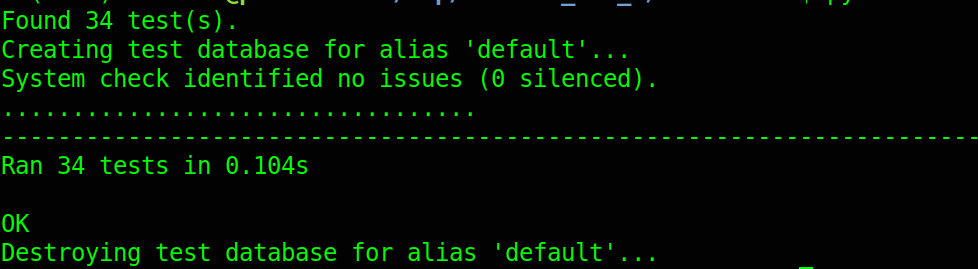
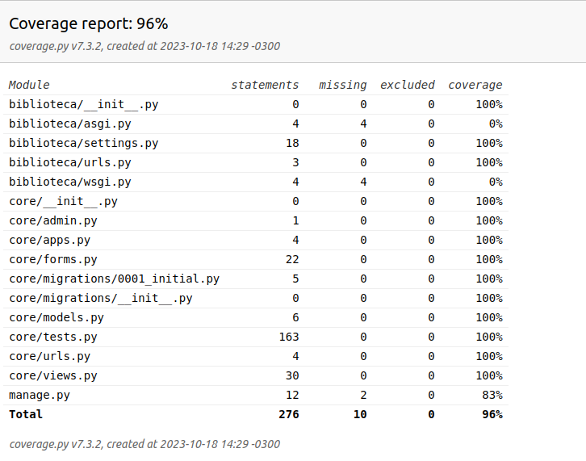

# Prática TDD

Desafio técnico para os alunos da disciplina "Desenvolvimento Web 3" e "Qualidade e Teste de Software"


[O que eu devo fazer ?](https://youtu.be/ywayPV7Y648)

No ambiente Linux:

```console
git clone https://github.com/orlandosaraivajr/Pratica_TDD_1.git
cd Pratica_TDD_1/
virtualenv -p python3 venv
source venv/bin/activate
pip install -r requirements.txt
cd biblioteca/
python manage.py migrate
python manage.py test
coverage run --source='.' manage.py test 
coverage html
python manage.py runserver
```

No ambiente Windows:

```console
git clone https://github.com/orlandosaraivajr/Pratica_TDD_1.git
cd Pratica_TDD_1/
virtualenv venv
cd venv
cd scripts
activate.bat
cd ..
cd ..
pip install -r requirements.txt
cd biblioteca/
python manage.py migrate
python manage.py test
coverage run --source='.' manage.py test 
coverage html
python manage.py runserver

```

### Requisitos da Sprint 1

O projeto apresenta um cadastro de livros. Na rota raiz (/), se apresenta dois botões, conforme imagem abaixo:


Ao acessar a rota cadastro (/cadastro), é possível cadastrar o livro, que armazena as seguintes informações:

- Título
- Editora



Ao acessar a rota listar (/listar), é possível verificar os livros cadastrados:



Todos os testes unitários estão passando, e o sistema funciona como previsto para a primeira sprint.



### Requisitos para a Sprint 2

Aqui começa seu desafio. Você deve implementar as seguintes melhorias:

#### Novos campos
O cliente deseja armazenar os novos campos referente a livros:

+ Autor
+ ISBN
+ Número de Páginas
+ Ano em que a obra foi escrita

#### Validação dos campos

O cliente deseja validar os campos com as seguintes regras:

+ Título:  Validar a string para cadastro com pelo menos 3 caracteres. Atualmente, espera-se ter pelo menos 10 caracteres.

+ Editora: Validar a string para cadastro com pelo menos 3 caracteres.
Atualmente, espera-se ter pelo menos 10 caracteres.

+ Autor: Validar a string para cadastro com pelo menos 10 caracteres.

+ ISBN: Validar a string para cadastro com exatos 13 caracteres e todos numéricos.

+ Número de Páginas: Validar a string para cadastro entre 1 e 3 caracteres e todos numéricos.

+ Ano: : Validar a string para cadastro com exatos 4 caracteres e todos numéricos. 

Além disso, na sprint 1, os campos Título e editora são obrigatórios. Nesta sprint, os novos campos serão obrigatórios também.

#### Ajustes nos testes

O código fonte passará por atualizações para acomodar estes novos requisitos. Com isso, você deve ajudar os testes existentes e, caso julgue pertinente, criar novos testes.

Você recebeu a sprint 1 com uma cobertura de teste acima de 90%.

